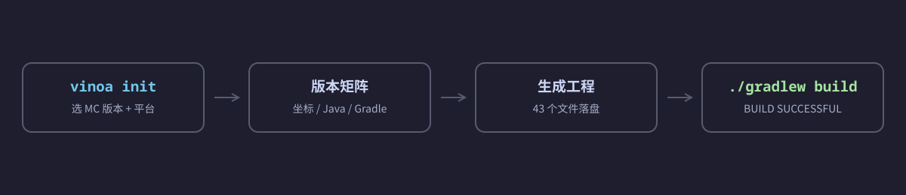
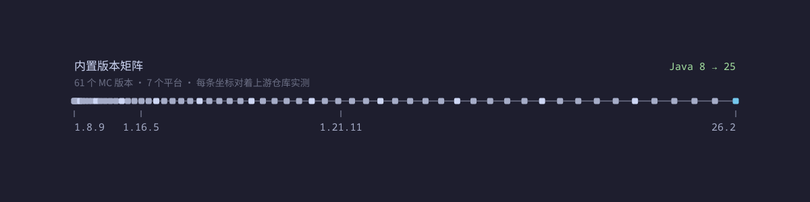

# vinoa


跑完一条 `vinoa init`，拿到手的工程 `./gradlew build` 直接绿。vinoa 干的就是这件事。

它给的是一份能直接构建的 Minecraft 服务端插件工程，不是一堆还得自己改的模板文件。模板它当然也在用，区别是那些容易写错的坑，矩阵已经提前填平了。

```bash
vinoa init my-plugin -p com.example.myplugin -m 1.21.11 --platform paper
cd my-plugin && ./gradlew build
```



## 它解决什么

Paper 没有 1.8.9 的 API，最早只到 `1.9.4`。Folia 要等到 `1.19.4` 才出现。Minestom 一共四个版本。`paper-api` 的坐标在 1.17 和 26.1 各翻过一次面。Java 最低版本从 8 一路涨到 25。

这些差异，靠手写模板记，记不全。

更麻烦的是，记错了不会当场报错。往往要等用户拿到工程，`./gradlew build` 失败，你才发现模板里那行版本号写歪了。

vinoa 把这些事实收进一份内置版本矩阵，每条坐标都对着上游仓库实测过。你只用选 MC 版本和平台，剩下的矩阵自己推。现成的插件模板要么只认一个平台，要么把版本号写死在脚本里，毛病都差不多。




## 特性

- 向导长得像 IDEA 的「新建项目」，工程、构建、目标服务端、附加四页，能往回退。
- 命令行这块对脚本和 AI 都友好。参数能全给，`--dry-run` 先看，`--json` 出单文档，非 TTY 自动降级，错误码和退出码是稳的，`vinoa schema` 自己描述自己。
- 多模块工程，`core/` 放平台无关的抽象，`platforms/<平台>/` 各自实现。勾上 `paper`，`bukkit` 兼容模块自动跟上。
- MC 1.8.9 到 26.2 都能出，平台七个，paper / bukkit / velocity / bungeecord / folia / sponge / minestom。默认离线、可复现，想要新数据就 `vinoa versions --refresh` 联网拉。
- 生成前跑一次环境预检，按目标反推需要的 Java 版本，再看本机有没有。16 以上走 toolchain，本机得装 JDK；16 及以下走 `options.release`，不用装。
- checkstyle、单元测试、build CI 默认就带；SpotBugs、覆盖率、发布工作流可选。
- 落盘是原子的，先写临时目录，最后整体 rename 过去，中途失败不留半个工程。

## 安装

一行装好，按本机平台取制品，校验 SHA256，原子就位：

```bash
curl -fsSL https://raw.githubusercontent.com/NmouZh/vinoa/main/scripts/install.sh | bash
```

Windows 用 `scripts/install.ps1`：

```powershell
irm https://raw.githubusercontent.com/NmouZh/vinoa/main/scripts/install.ps1 | iex
```

默认装到 `~/.local/bin/vinoa`（Windows 是 `%LOCALAPPDATA%\vinoa\bin\vinoa.exe`）。没在 PATH 里的话，装完直接告诉你该敲哪一行，不用自己猜。

### 安装器跟 vinoa 本体是同一套东西

安装器和 CLI 遵守同一份规格：

| 约定 | 表现 |
|---|---|
| `--dry-run` | 走同一条解析 / 校验 / 计划路径，一个字节都不落盘（预览即实际） |
| `--json` | stdout 恰好一个 `vinoa.install/v1` 文档；人读文本一律走 stderr，中断也一样 |
| 退出码 | 与 CLI 共用一张表：`0` 成功 · `2` 校验失败 · `64` 用法 · `65` 数据 · `73` 无法创建 · `74` IO · `75` 临时失败 · `78` 配置 · `130` 中断 |
| 界面 | 色值取 [`tokens.md`](docs/spec/ui/tokens.md) §3.1 的三档表；真彩 / 256 / 16 / 无色按 [`degradation.md`](docs/spec/ui/degradation.md) 降级，非 TTY 零 ANSI |
| 错误 | 三要素齐备，发生了什么 / 下一步动作 / 可复现命令（[`shell.md`](docs/spec/ui/shell.md) §4.3） |

另外两条硬规则：

- 校验缺失不静默通过。取不到 `SHA256SUMS` 就如实登记进 `--json` 的 `skipped[]` 并警告，不假装校验过，`--no-verify` 同理。
- 落盘是原子的。先写同目录临时文件，`rename` 就位；中途失败不留半个文件，中断（Ctrl-C）会清理临时目录且不动已有安装。

### 常用参数

```bash
bash scripts/install.sh --version v0.1.0 --dir /usr/local/bin   # 指定版本与目录
bash scripts/install.sh --dry-run --json                        # 预览（agent 用）
bash scripts/install.sh --from ./vinoa-v0.1.0-x86_64-unknown-linux-gnu.tar.gz   # 离线安装
bash scripts/install.sh --target aarch64-unknown-linux-musl     # 交叉指定三元组
bash scripts/install.sh --no-verify                             # 跳过校验（如实登记）
bash scripts/install.sh --mirror https://gh-proxy.com/https://github.com/NmouZh/vinoa/releases/download
bash scripts/install.sh --help                                  # 全部参数与取值表
```

制品命名约定：`vinoa-<tag>-<target>.tar.gz`（Windows 是 `.zip`），校验清单是同一目录下的 `SHA256SUMS`。

支持的目标三元组：`x86_64-unknown-linux-gnu` · `aarch64-unknown-linux-gnu` · `x86_64-unknown-linux-musl` · `aarch64-unknown-linux-musl` · `x86_64-apple-darwin` · `aarch64-apple-darwin` · `x86_64-pc-windows-msvc` · `aarch64-pc-windows-msvc`。不在这张表里的平台，`--target` 会硬报错并列出可用项，不会静默换一个装。

## 从源码构建

```bash
cargo build --release       # 产物在 target/release/vinoa
cargo test                  # 单测
```

## 常用命令

```bash
vinoa init                                  # 向导
vinoa init --help                           # 全部参数
vinoa init my-plugin -p com.a.b -m 1.21.11 --platform paper --platform velocity -y
vinoa init my-plugin -m 1.8.9 --platform bukkit -y
# 可选模块（sqlite / bstats / update-check / placeholderapi / gui / spotbugs / coverage / release-ci）
# 正在补齐中，模板集尚未实现的 feature 会被硬报错拦住，不会静默生成空工程。
vinoa init -c vinoa.toml -y                 # 从配置文件
vinoa init my-plugin -m 1.21.11 --platform paper -y --print-config   # 导出配置
vinoa init my-plugin -m 1.21.11 --platform paper -y --dry-run --json # 预览（agent 用）
vinoa versions --refresh                    # 刷新版本矩阵
vinoa schema --json                         # 自描述
```

## 生成出来的工程

```
my-plugin/
├─ settings.gradle.kts · build.gradle.kts · gradle/libs.versions.toml
├─ gradlew · gradle/wrapper/            # Gradle 9.8.0
├─ core/                                 # 平台无关：命令 / 配置 / 消息 / 权限 / 调度 / 发送者
├─ platforms/paper/                      # 主类 + 示例命令 + 示例监听器 + plugin.yml + config.yml
├─ platforms/bukkit/                     # 勾 paper 时自动带上
├─ config/checkstyle/ · .github/workflows/build.yml
└─ README.md · LICENSE(Apache-2.0) · CHANGELOG.md
```

平台差异也交给矩阵。`plugin.yml` 和 `paper-plugin.yml` 声明命令的方式互斥，模板不会两个都生成。老版本目标走 `options.release`，新的走 Java toolchain。

## 验收

```bash
bash scripts/acceptance.sh 1.21.11 paper    # 单行：生成 → 自查残留 → ./gradlew build → 查 jar
bash scripts/acceptance-all.sh              # A2/A3/A6/A7 + B 级
bash scripts/install-acceptance.sh          # 安装器：44 项断言，跑在本地 fixture 上，不联网
```

`install-acceptance.sh` 覆盖安装器自己的契约，`--dry-run` 不落盘、`--json` 单文档、SHA256 篡改 → 退出码 2、404 时列出可用制品、幂等与无残留、三档色值与宽度降级、真 pty 下的 `^C` → 130。降级优先级链（`NO_COLOR` 空串不触发、`NO_COLOR` 高于 `CLICOLOR_FORCE`、`--color=always` 推不翻能力层）由 `install-acceptance-pty.py` 在真 pty 里逐条验。非 TTY 下这些条件会被同一条分支短路掉，验不出优先级。

`scripts/install.ps1` 与 `install.sh` 同契约，但本仓库 CI 只做冒烟（`-Help` 加 `-DryRun -Json` 可解析）。沙箱里没有 PowerShell 运行时，逻辑未经实机验证。

下面这些组合属于 [`docs/spec/vinoa-cli.md`](docs/spec/vinoa-cli.md) §12 的保证矩阵，CI 上真跑 `./gradlew build`，覆盖 `1.8.9 bukkit`、`1.12.2`、`1.16.5`、`1.21.11`、`26.2` 的 paper，再加两个代理端。`folia`/`sponge`/`minestom` 和其它变体是 best-effort。

## 文档

- 规格，唯一事实来源：[`docs/spec/vinoa-cli.md`](docs/spec/vinoa-cli.md)
- 决策草稿：[`docs/spec/drafts/`](docs/spec/drafts)
- 事实研究，每条都有来源：[`docs/research/`](docs/research)
- 工作方式，issue tracker 和 wayfinder 操作：[`AGENTS.md`](AGENTS.md)、[`docs/agents/`](docs/agents)

## 许可证

Apache-2.0。参考了社区模板 `CrimsonWarpedcraft/plugin-template`（GPL-3.0，只参考了结构和工程纪律，代码没复制）和 `sVoxelDev/multi-platform-plugin-template`（MIT）。
